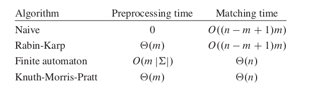

# 算法基础笔记
要常去思考书中算法是怎么想出来的！

## 思想总结
1. 分治法（合理划分，merge时可节省时间时才可行）：4.2
2. 循环不变式：5 | 9.3
   + 初始化、保持、终止
3. 稳定排序算法的作用：7.1
4. 若进行多优先级排序，低优先级的排序先进行（允许被高优先级打乱）:7.2
5. **最坏时间为线性的选择算法：**确保分治有**确定的相对平衡划分**：8.2
6. **动态规划**
   1. 找出最优解的性质，并刻画其最优子结构特征;
   2. 递归地定义最优值(写出动态规划方程，**类似分治法子问题和原问题的关系式**);
   3. 以自底向上的方式计算出最优值；**通常将子问题所做的选择存在一个表中**
   4. 根据计算最优值时记录的信息，构造最优解。
7. 贪心算法设计和证明思路

   1. **活动选择 Th16.1的启示：**先想想证明的时候，如果按用来进行贪心选择的性质（如结束时间最早）去替换，怎么才能保持正确性不变呢

   2. **贪心算法的最优性证明：**把贪心解与任一最优解相比较，如果这两个解不同，就去找开始不同的第一个xi，然后设法用贪心解的xi去代换最优解的xi，并证明最优解在分量代换之后其总价值保持不变，反复进行下去，直到新产生的最优解与贪心解完全一样，从而证明了贪心解是最优解。
8. 最优子结构性质和贪心选择性质的区别：

   + 最优子结构性质：设X= （x1 ， x2 ， x3 ， x4 )是问题钱数为A的最优解，则X‘ = (0， x2 ， x3 ， x4 )是子问题钱数为A - d1*x1的最优解。
   + 贪心选择性质：设X= (x1 ， x2 ， x3 ， x4 )是贪心解 ， Y=(y1 ， y 2 ， y3 ， y 4 )是最优解。则 X= Y.

9. 摊还分析不同于平均情况分析，它并不涉及概率，它可以保证**最坏情况下每个操作的平均性能**

#### 1 Introduction (ch1)	
+	算法的作用  

#### 2 Getting Start (ch2，no slides)
+	无

#### 3 Growth of Functions (ch3， no slides; summation methods)
+	猜测法（**修正细节**）、迭代和递归树
+	Master定理

## 4 Divide and Conquer (recurrence no slides，supplement 1)  
1.	递归分析
   1. 猜测证明法
   2. 递归树
   3. 主方法
2.	递归设计
   +	全排列
   +	集合 k 划分数
3.	分治法
   +	大整数分治乘法
   +	Strassen 矩阵乘法
   +	 *\*开关问题*

## 5 Heapsort (ch6， no slides)
+	数据结构（数组、下标关系）
+	整堆
+	建堆（**循环不变式**）
+	堆排序
+	应用：优先队列

## 6 Quicksort(ch7， no slides; performance analysis)
+	PARTITION算法（**什么时候交换、移动**）
+	最坏情况（不比插入排序好）

## 7 Sorting in Linear Time (ch8)	
1.	基于比较的排序算法下界：Ω(nlogn)，可用**决策树**证明
2.	计数排序（稳定排序）
   + **作用在基数排序中显现：若高位一样，不应该打乱原来低位的顺序**）
3.	基数排序
   + **低位先排，因为可以被后面的高位打乱**
   + **进制基k选为n，则为线性算法**
4.	桶排序
  + 假设均匀分布
  + 每个区间用链表和插入排序

## 8 Medians and Order Statistics (ch9，重点！！！)
1.	最小值、最大值
   + **书本练习9.1-1很好！**
2.	**选择第i大的元素**
   1.	期望时间为线性：利用快排的Partition函数，分治
   2.	最坏时间为线性：确保分治有**确定的相对平衡划分**

## 9 Red-Black Trees (ch13)	
1.	引理的证明
2.	旋转（指针的不重不漏）
3.	插入
	+ case1
	+ (case2->)case3	
	+ **循环不变式：P180**
4.	删除（**好难啊！~~~ **）
	
## 10 Augmenting Data Structures (ch14)

1.	定理14.1（红黑树的扩张），及其证明：分别证明插入和删除的复杂度都仍为O(logn)
2.	区间树（**搜索重叠区间的算法的正确性**）

## **11 Dynamic Programming (ch15)**	
1. 
<b>求解步骤：</b>   
   (1). 找出最优解的性质，并刻画其最优子结构特征;    
   (2). 递归地定义最优值(写出动态规划方程);   
   (3). 以自底向上的方式计算出最优值;  
   计算    
   (4). 根据计算最优值时记录的信息，构造最优解。
 

2. 实现方法

   1. 带备忘的自顶向下法
   2. 自底向上法

3. 适用条件

   1. 最优子结构：
      + 最优性原理判别举例：课件 ch15 P12-14 
   2. 重叠子问题

4. 重构最优解（类似Matrix链中的 s[i，j] 保存 k 即右括号位置）

   + 通常将子问题所做的选择存在一个表中

5. **微妙之处**：注意问题是否有最优子结构性质，书本 P217

   + 无权最短路径：具有最优子结构性质
   + 无权最长路径：不具有最优子结构性质，**因为子问题最优解可能已经经过原问题的目的点**

6. 算法设计举例：

   1. 钢条切割
   2. 矩阵链乘法
   3. 最大子段和（**原问题和子问题的关系**）
   4. 最长公共子序列
   5. 0-1背包问题

## 12 Greedy Algorithms (ch16)

1. **贪心算法的正确性**，就是要证明按贪心准则求得的解是全局最优解。

2. **贪心算法的最优性证明：**把贪心解与任一最优解相比较，如果这两个解不同，就去找开始不同的第一个xi，然后设法用贪心解的xi去代换最优解的xi，并证明最优解在分量代换之后其总价值保持不变，反复进行下去，直到新产生的最优解与贪心解完全一样，从而证明了贪心解是最优解。
   

3. 适合求解问题的特征：

   1. 贪心选择性质:可通过局部最优 (贪心) 选择达到全局最优解；
   2. 最优子结构性质:问题的最优解包含它的子问题的最优解；
      + 并不是所有具有最优子结构性质的问题都可以采用贪心策略;
      + 往往可以利用最优子结构性质来证明贪心选择性质;

4. 与动态规划法的比较：课件 ch16 P9（书本 P243-244)

   + 示例：P10-12
     + 小数背包问题可以用贪心策略求解
     + 0-1背包问题**却**不可以

5. 算法设计举例

   1. 小数背包问题：**最优性证明**，在课件 ch16 P16-18

   2. 活动安排：**最优性证明**，在书本 P239

   3. 最优装载：**最优性证明**，在课件 ch16 P34
   4. 找钱问题：同时有**最优子结构性质**和**贪心选择性质**证明

## 13 回溯法（sch2）

1. 回溯法是一个既带有系统性又带有跳跃性的搜索算法。
   1. 系统性：它在包含问题的所有解的解空间树中，按照深度优先的策略，从根结点出发搜索解空间树。
   2. 跳跃性：算法搜索至解空间树的任一结点时，判断该结点为根的子树是否包含问题的解，如果肯定不包含，则跳过以该结点为根的子树的搜索，逐层向其祖先结点回溯。否则，进入该子树，继续按深度优先的策略进行搜索。

2. 提高回溯法效率的二种方法
   1. 用约束函数剪去不满足约束的子树；
   2. 用限界函数剪去不能得到最优解的子树。

3. 二类常见的解空间树
   1. 子集树：算法框架为分两个分支，先置为1走左子树，再置为0走右子树。
   2. 排列树：算法框架为循环，递归前swap产生一个排列。递归后swap回来。

## 14 摊还分析（ch17）

1. 在摊还分析中，我们求数据结构的一个操作序列中执行的所有操作的平均时间，来评价操作的代价。

   摊还分析不同于平均情况分析，它并不涉及概率，它可以保证**最坏情况下每个操作的平均性能**

2. 聚合分析：先求出一个 n 个操作得序列最坏情况下花费的总时间 T(n)，再求平均。

3. 记账算法：对不同操作赋予**不同摊还代价**。

   将序列中某些较早的操作的 “余额”( 摊还代价超出实际代价的部分 ) 存起来成为**信用**，用来支付之后的，计算的摊还代价小于实际代价的情况。

4. 势能法：也是分析每个操作的摊还代价，也是通过较早的操作的 “余额” 来补偿稍后操作的差额。不同的地方在于，势能法将信用作为**数据结构的 “势能”** 储存起来。

## 15 二项堆（textbook.v2 ch19）

1. 
<b>优先队列</b>：二项堆是优先队列的具体数据结构实现的优化发展过程中的一个产物

2. A mergeable heap (可合并堆)is any data structure that supports the basic heap operation plus union.
3. Operations on a Binomial Heap
   1. Union算法挺重要
   2. Extract_Min中删除某二项树之后的 **“reverse the order of the linked list of x's children"**挺重要

4. 二项堆在**图论中的应用**

## 16 不相交集数据结构（ch21）

1. Application: Dynamic connected components，森林树

2. **two-pass method** 两趟方法：FIND-SET过程递归时查找，回溯时更新parent节点。

## 17 图论算法（ch22-25）

1. Elementary Graph Algorithms

   1. 图的表示

   2. BFS

      1. 涂色的含义
         + White – Undiscovered.
         + Gray – Discovered but not finished
         + Black – Finished.

      2. BFS for Shortest Paths
         1. **d属性、π属性**：v.d表示 v 到源节点 s 的距离，v.π 表示 v 的前驱结点。
         2. 正确性：书本P346-347

      3. **广度优先树**：书本P348

   3. DFS

      1. **d属性、f属性：**发现时间和完成时间
      2. 边的分类：
         + 树边
         + 后向边
         + 前向边
         + 横向边

      3. 应用：

2. Minimum Spanning Trees

   1. 通用方法：即遵循循环不变式，书本P363

   2. **安全边：**书本P364 定理 23.1

   3. Kruskal算法：（找到安全边的办法）在所有的连接森林中两棵不同树的边里面，找到权重最小的边(u,v)。

      

   4. Prim算法：所具有的一个性质是集合A中的边总是构成一棵树。

      

   5. 两个算法的复杂度都是 O(ElgV)

3. Single-Source Shortest Paths

   1. **松弛技术(d属性)**：v.d 表示从源节点 s 到节点 v 的最短路径权重的上界我们称 v.d 为 s 到 v 的**最短路径估计**

      1. v.d 初始化为 ∞

      2. 松弛操作：

         + Dijkstra’s algorithm and the shortest-paths algorithm for directed acyclic graphs relax each edge exactly once.

         + The Bellman-Ford algorithm relaxes each edge |V| - 1times.

      3. 一些性质

   2. Bellman-Ford算法：**允许有环、允许有负权重边**，O(|V|·|E|)
      1. 正确性证明：PPT ch22-25-part2 P36-37，书本P380
      2. **DAG算法：先进行拓扑排序（不允许有环）**，然后按拓扑序，先对前面的点的邻点进行松弛操作。
         + 时间复杂度：Θ(|V|+|E|)
   3. Dijkstra算法：**不允许有负权重边**，类似广度优先搜索。

4. All-Pairs Shortest Paths
   1. 一些预备
      1. Assuming：可以有负权重边，但之后都假设输入的图不存在负权重环。
      2. Predecessor matrix
      3. 递归解：设
   2. Shortest paths and matrix multiplication
   3. Floyd-Warshall Algorithm
   4. Johnson Algorithm for sparse graphs

## 18 数论算法（ch31）

## 19 串匹配（ch32）

1. 各种字符串匹配算法的 “预处理时间” 和 “匹配时间”

   

2. Naïve：问题出在，当匹配到 s 位不匹配之后，直接比较移动头指针，忽略了匹配的s 位所隐含的信息

3. Rabin-Karp：企图把模式串转换成数字，以及待匹配文本中所有和模式串等长的串也这样转换。

4. **Finite automaton：**有限自动机，不同状态代表不同有效前缀

   + 每次转移以 "下一字符" 为输入，需要考虑所有的输入空间，因此预处理时间很大，这就引出了KMP算法

5. **KMP：**只计算，如果在第 q+1 位匹配失败，那么已匹配文本串最多有多长的后缀仍是有效的，即匹配失败后 ( 不管输入是什么 ) q = π[q]
   $$
   π[q] = max\{k :k<q且P_kコP_q\}
   $$

   + 前缀函数的计算，即**预处理函数也写得很好**！书本 P590 

6. *Indexing Method: BWT (Suppl.)*